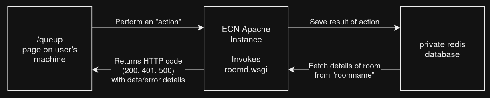
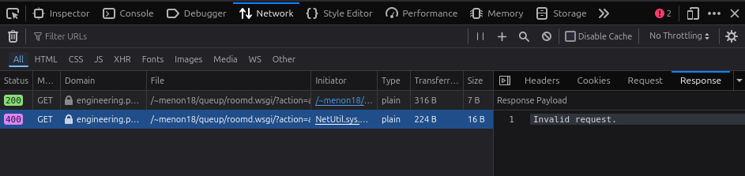

# Development notes

## 1. Bidirectional communication on a very limited ECN Apache instance

This QueUp was designed in a way that overcame the limitations of running a web service that requires **persistent connections** like WebSockets/long polling and other such bidirectional communication schemes over HTTP 1.1, by making use of an older, but reliable, protocol called **Server-Sent Events**.  This is required because ECN Apache instances do not permit the use of WebSockets.

On the client side, SSEs are well implemented in JavaScript and are supported by all modern browsers - it is called `EventSource`. 

```javascript
const evtSource = new EventSource("roomd.wsgi?sseupdate=true&room=" + roomname);
const evtSource.onopen = function() {
    console.log("Connection established.");
};
```

On the server side, we implement it using a WSGI Python script hosted on the Apache server.

```python
start_response('200 OK', [
    ('Content-Type', 'text/event-stream;charset=utf-8'),
    ('Cache-Control', 'no-cache;public'),
    ('Connection', 'keep-alive'),
])

# ... 
# when an update occurs, or after 120 seconds (and then quit if no changes occur)...
yield ("data: %s\n\n" % json.dumps(getusers("", room))).encode()
```

## 2. Queup System Layout



The Queup is split into three parts:
- `app.html`, which is what you see when you visit the Queup site.
- `roomd.wsgi`, which is the WSGI script that handles the server-sent events and the REST API.
- A privately accessed Redis database only visible to the Apache server into which all room details are stored.

When you do anything on the page that needs to update the "contents" of a room (adding a user to a queue, deleting a queue, locking the room, etc.), that action is handled by roomd.wsgi, which then updates the Redis database and sends an update to all clients in that room.

## 3. Debugging

The Queup system is designed to be as simple as possible, but there are a few things that can go wrong. 

For nearly all messages that say "an error occurred" - ensure that you are not first doing an illegal action, like attempting to change details of a room where you are not an owner.  If you are sure that you are not doing anything wrong, then ensure you are connected to the internet and that you are logged in.  To re-verify the latter, try an incognito window and make sure you are logging in with your Purdue username and regular password.

If the error is fully unexpected, `roomd.wsgi` may have errors.  Look at the response being sent by the server in the browser's developer console.  If it is not a 200 OK, then there is an error in the script.  Check that the response gives you any useful info.  



If it returns the default "Internal Server Error" Apache page, the error failed to be caught by the script.  Check the Apache error log under `var/log/error_log` under your specific ECN web account for more info.