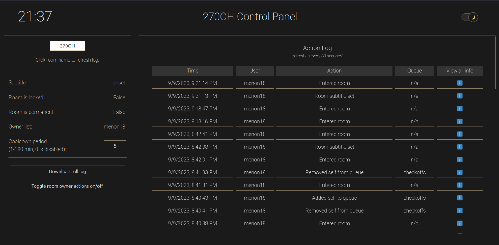

# QueUp
The QueUp system is designed to give Purdue ECE students and staff the ability to quickly create a queuing room, capable of handling multiple queues, and to be able to customize it to fit your class needs.

## Quick Start
- Generate a room code by clicking the 🔁 button.  (Room codes can only be 5 alphanumeric characters.)  Click "Create".
- To join a queue, click the "+" button for a specific queue.  To leave a queue, click the button with your username on it.
- Share the room code with anyone who wishes to join the queue.  They must enter the code in the "Join a room" panel.
- Each room also has a description that you can customize to help users ensure they're in the right room.  

[description.webm](https://github.com/ece270/queup/assets/12859429/a9a0d82e-fd0c-4d5c-9175-98ee7f99c158)

## Queues

### Adding a queue
The large "Add Queue" button at the bottom of the page will let you add a queue.  Click that, specify a name, and confirm.

[addqueue.webm](https://github.com/ece270/queup/assets/12859429/cd5ced67-b3cf-4680-b8ff-520642f65aca)

### Renaming a queue
You can rename the "default-queue" to whatever you wish (checkoff, help, aisle1, etc.), as well as add new queues with their own names as well.  Click the name of the queue to rename it (which will add a cursor to the text box).  

[queuename.webm](https://github.com/ece270/queup/assets/12859429/bc6d5a66-e9b0-41f7-b8fc-a52573f97c84)

### Deleting a queue
Renaming the queue to an empty string will delete the queue, after asking you to confirm.  You will not be able to delete a queue if it's the only queue in the room - add a second queue before you delete the first one, if you must.

## Owners

If you create a room, you are automatically the "owner" for the room, which is what lets you set the room description and add/rename queues.  If you wish to give someone else the same privileges as you, click the ⚙️ icon, click "Add room owners", and type in a list of Purdue account usernames, separated by commas.  

[addowner.webm](https://github.com/ece270/queup/assets/12859429/c4e54ea8-857b-4aa0-9930-f1a025c4e32a)

You can also remove owners (including yourself) by clicking the ⚙️ icon and clicking "Delete room owners", with the same input requirements.  Be sure to have at least one owner for the room - zero owners are not permitted as the room will be inaccessible.
Each room will remain open as long is there is some activity for 24 hours, after which it will be deleted.  You can also delete a room manually by clicking the ⚙️ icon and clicking "Close Room".  

As a measure of protection, non-owners cannot edit the room description or add/rename queues.

## Marking

Room owners, who are typically staff members or TAs, may also "mark" a student who added themselves to the queue to indicate that they are being helped.  They can either unmark or delete the student.  

[marking.webm](https://github.com/ece270/queup/assets/12859429/c7632f67-ac60-4431-844f-89890ad8b68e)

Room owners may also lock/unlock the room via the Settings panel to ensure that attendees cannot stuff the queue before office hours have actually started.  By default when a room is created, it is unlocked.

## Room Permanency

By default, all rooms are temporary, which means that they will be removed after 24 hours of inactivity.  This is a necessary measure to ensure the system will not use an inordinate amount of disk space.  If you wish to make your room permanent so that you don't need to recreate it, possibly due to having a large number of room owners and/or customized queues, please contact Niraj (niraj@purdue.edu) for the room to be added to a permanent list.

## Admin Portal

The admin portal allows room owners to view the action log for their rooms, which includes every single action performed by users of that room.  The page for any room can be accessed by going to /queup/admin/?room=ROOMCODE, where ROOMCODE is the room code for the room you wish to view.  You must be a room owner to view the admin portal for a room.

The admin portal also indicates what settings have been set for the room, as well as the ability to view and set the cooldown period for a room, which is the amount of time a user must wait before they can add themselves to the same queue again.  The cooldown period is set to 0 minutes (no limit) by default.  To change the value, enter a number higher than 0 and hit Enter.

The full log when downloaded will have coded values for the actions performed, which are as follows:

| Code | Action |
| --- | --- |
| `rcreate` | Created room |
| `rchk` | Entered room |
| `rdel` | Deleted room |
| `rown` | Added owner(s) to room |
| `rdelown` | Deleted owner(s) from room |
| `rsub` | Room subtitle set |
| `runlock` | Unlocked room |
| `rlock` | Locked room |
| `rcool` | Set cooldown period |
| `qadd` | Created queue |
| `qdel` | Deleted queue |
| `qren` | Renamed queue |
| `qclr` | Cleared queue |
| `qmrk` | Marked/unmarked on queue |
| `uadd` | Added self to queue |
| `udel` | Removed self from queue |
| `usdel` | Staff removed user from queue |

Here is what it could look like:  

